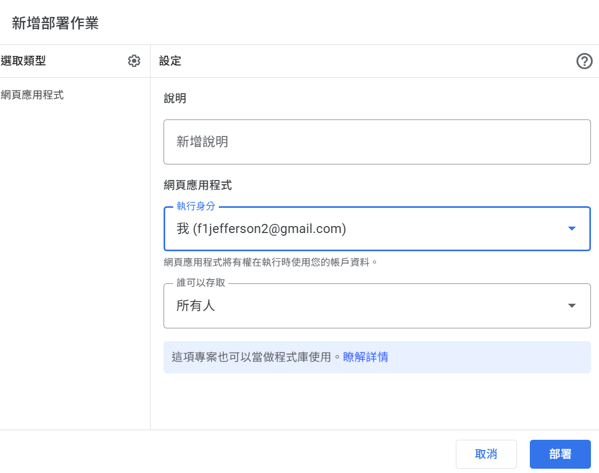

# ClipboardSync
利用google sheet和[iOS內建捷徑app](https://apps.apple.com/us/app/shortcuts/id915249334) 讓pc的剪貼板和 ios 裝置同步。達到如同Apple裝置之間[Univeral Clipboard](https://support.apple.com/en-us/102430)的功能。

# 開發工具

- Google sheet
- Google App Skcript
- iOS shortcut
- [Autohotkey](https://www.autohotkey.com/)

# 使用說明

## 步驟1：新增Google Sheet雲端文件
到 [Google Sheet](https://docs.google.com/spreadsheets/u/0/) 新增文件
文件檔名可為任意名稱

## 步驟2：為Google Sheet文件加上App Script
1. 點選「擴充功能」 → 「Apps Script」

2. 貼上以下程式碼並保存
```
function doGet(e) {
  var sheet = SpreadsheetApp.getActiveSpreadsheet().getActiveSheet();
  var lastRow = sheet.getLastRow();
  var lastText = lastRow >= 1 ? sheet.getRange(lastRow, 2).getValue() : "";
  return ContentService.createTextOutput(
    JSON.stringify({
      clipboard: lastText,
      rowCount: lastRow
    })
  ).setMimeType(ContentService.MimeType.JSON);
}

function doPost(e) {
  var sheet = SpreadsheetApp.getActiveSpreadsheet().getActiveSheet();
  var command = e.parameter.command;
  var clipboardText = e.parameter.clipboard;
  var timestamp = new Date();

  if (command === "CLEAR_CLIPBOARD") {
    sheet.clear();  // 清空整張表
    return ContentService.createTextOutput("CLEARED");
  }

  // 寫入剪貼簿內容
  if (clipboardText !== undefined) {
    sheet.appendRow([timestamp, clipboardText]);
    return ContentService.createTextOutput("OK");
  }

  return ContentService.createTextOutput("NO_ACTION");
}
```


## 步驟3：部署App Script
1. 點選「部署」→「新增部署作業」

2. 誰可以存取請**務必**選擇「所有人」

3. 複製網頁應用程式網址

## 步驟4：下載Apple Shortcut腳本
在iOS取得pc複製的內容：[https://www.icloud.com/shortcuts/06966cbb200c49d992e5e0a29af655d3](https://www.icloud.com/shortcuts/06966cbb200c49d992e5e0a29af655d3) 

上傳iOS複製的內容，以在pc上貼上：[https://www.icloud.com/shortcuts/016021bff96744efa843faa85520339d](https://www.icloud.com/shortcuts/016021bff96744efa843faa85520339d)

請輸入您的App Script URL


## 步驟5：下載並執行ClipboardSync
[下載連結](https://github.com/y1lichen/clipboard-sync/releases/)
執行ClipboardSync後，app會在菜單欄托盤於背景執行。修改config.ini可自定義功能。

## 步驟6：修改config.ini可自定義功能

- 將google_script_url設為您的Google App Script URL。
- interval_ms為自動同步間隔，單位為亳秒。設為0可取消自動同步。
- max_clipboard_length為遠端剪貼簿的暫存的最大筆數。當google sheet上資料筆數超過此值時會自動清除，設為0可關閉自動清除。
