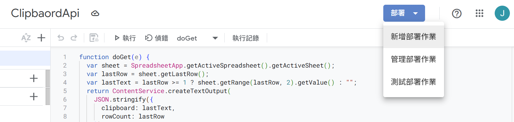

# ClipboardSync

利用google sheet和[iOS內建捷徑app](https://apps.apple.com/us/app/shortcuts/id915249334) 讓pc的剪貼板和 ios 裝置同步。達到如同Apple裝置之間[Univeral Clipboard](https://support.apple.com/en-us/102430)的功能。 

[點我查看中文README](./README-zh.md) 

Synchronize your clipboard between a PC and iOS device using Google Sheets and the [iOS Shortcuts app](https://apps.apple.com/us/app/shortcuts/id915249334), achieving functionality similar to [Apple's Universal Clipboard](https://support.apple.com/en-us/102430).

---

# Development Tools

- Google Sheets  
- Google Apps Script  
- iOS Shortcuts  
- [AutoHotkey](https://www.autohotkey.com/)

---

# Instructions

## Step 1: Create a New Google Sheets Document

Go to [Google Sheets](https://docs.google.com/spreadsheets/u/0/) and create a new spreadsheet.  
The filename can be anything you like.

---

## Step 2: Add an Apps Script to Your Spreadsheet

1. Click **Extensions → Apps Script**  
   

2. Paste the following code and save it:
```
function doGet(e) {
  var sheet = SpreadsheetApp.getActiveSpreadsheet().getActiveSheet();
  var lastRow = sheet.getLastRow();
  var lastText = lastRow >= 1 ? sheet.getRange(lastRow, 2).getValue() : "";
  return ContentService.createTextOutput(
    JSON.stringify({
      clipboard: lastText,
      rowCount: lastRow
    })
  ).setMimeType(ContentService.MimeType.JSON);
}

function doPost(e) {
  var sheet = SpreadsheetApp.getActiveSpreadsheet().getActiveSheet();
  var command = e.parameter.command;
  var clipboardText = e.parameter.clipboard;
  var timestamp = new Date();

  if (command === "CLEAR_CLIPBOARD") {
    sheet.clear();  // Clear the entire sheet
    return ContentService.createTextOutput("CLEARED");
  }

  // Append clipboard content
  if (clipboardText !== undefined) {
    sheet.appendRow([timestamp, clipboardText]);
    return ContentService.createTextOutput("OK");
  }

  return ContentService.createTextOutput("NO_ACTION");
}
```


## Step 3: Deploy the Apps Script

1. Click **Deploy → Manage deployments**  
   

2. For "Who has access", make sure to select **"Anyone"**  
   

3. Copy the Web App URL  
   

---

## Step 4: Download the Apple Shortcuts

- To retrieve clipboard content copied on your PC to iOS:  
  [https://www.icloud.com/shortcuts/06966cbb200c49d992e5e0a29af655d3](https://www.icloud.com/shortcuts/06966cbb200c49d992e5e0a29af655d3)

- To upload clipboard content from iOS and paste on your PC:  
  [https://www.icloud.com/shortcuts/016021bff96744efa843faa85520339d](https://www.icloud.com/shortcuts/016021bff96744efa843faa85520339d)

Enter your App Script Web App URL inside the shortcut:  


---

## Step 5: Download and Run ClipboardSync

[Download ClipboardSync](https://github.com/y1lichen/clipboard-sync/releases/)

Once launched, the app will run in the background as a tray icon.  

## Step 6: Customize Features via `config.ini`

- Set `google_script_url` to your Google Apps Script Web App URL.
- `interval_ms` defines the auto-sync interval in milliseconds. Set to `0` to disable auto-sync.
- `max_clipboard_length` specifies the maximum number of clipboard entries stored remotely.  
  If the number of rows in the Google Sheet exceeds this value, the clipboard will be automatically cleared.  
  Set to `0` to disable auto-clearing.

